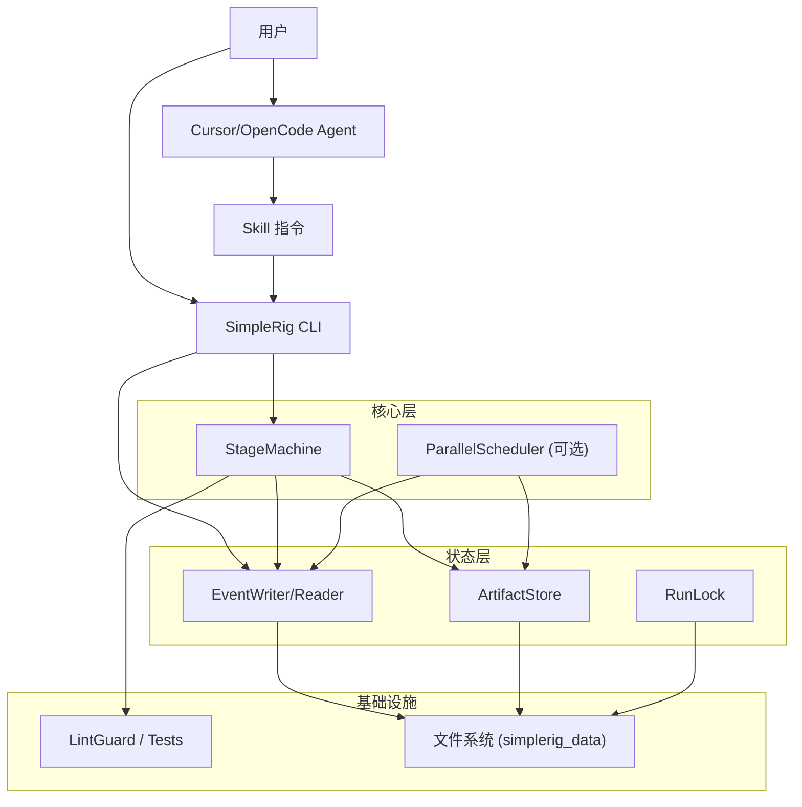

# SimpleRig 技术架构文档

> 版本: 1.1.0
> 更新日期: 2026-02-06

## 1. 架构概览

SimpleRig 是一个基于 **Event Sourcing（事件溯源）** 的多阶段工作流框架。LLM 由编辑器（Cursor / OpenCode）提供，SimpleRig 负责 **事件记录、产物管理、断点续传与可观测性**。编辑器内 Agent 通过 Skill 指令调用 CLI（`init/emit`）记录事件；`simplerig run` 仍保留为本地阶段机演示/调试入口。

### 交互入口

- **编辑器 Agent**：读取 Skill，按阶段执行开发，并用 `simplerig init/emit` 记录事件
- **CLI**：提供 `init/emit/status/tail/list/stats`；`run` 用于演示阶段机（stub 逻辑）

### 核心组件分层



## 2. 核心机制详解

### 2.1 事件溯源 (Event Sourcing)

SimpleRig 的“事实源（Source of Truth）”不是内存中的对象，而是磁盘上的 `events.jsonl` 文件。

*   **存储格式**：JSON Lines。每行一个完整的事件对象。
*   **事件结构**：
    ```json
    {
      "seq": 12,
      "type": "stage.completed",
      "timestamp": "2026-02-06T08:10:00+00:00",
      "run_id": "20260206_081000_ab12cd34",
      "data": {
        "stage": "plan",
        "outputs": [
          {
            "ref": "artifacts/plan.json",
            "sha256": "…",
            "size": 1234,
            "mime": "application/json"
          }
        ],
        "duration_ms": 1200
      }
    }
    ```
*   **优势**：
    *   **可恢复性**：重读 `events.jsonl` 即可重建 Run 状态。
    *   **可观测性**：`simplerig tail` 直接消费事件流。
    *   **解耦统计**：统计与业务逻辑分离，仅消费事件。
*   **Token 记录**：
    *   SimpleRig 不直接调用模型，Token 需要由编辑器/Agent 写入事件
    *   记录方式：`llm.called` 事件，或在 `stage.completed/task.completed` 中写入 `token_usage`

### 2.2 阶段机与阶段处理器 (Stage Machine)

SimpleRig 默认使用四阶段流水线：`plan → develop → verify → integrate`。阶段机负责事件记录与产物校验：

*   **StageMachine**：按顺序执行阶段，写入 `stage.*` 事件
*   **ArtifactStore**：写入产物并计算 SHA256，用于跳过已完成阶段
*   **阶段输出**：
    * `plan.json`：规划结果（当前为 stub 实现）
    * `code_changes.json`：变更记录（当前为 stub 实现）
    * `verify_result.json`：Lint/Test 结果
    * `integration_result.json`：集成结果（当前为 stub 实现）

### 2.3 任务调度与并行 (DAG Scheduler)

调度器维护一个内存中的 DAG（有向无环图），当前作为独立模块存在，可用于执行规划阶段产生的任务列表。

*   **状态流转**：
    *   `PENDING`: 等待前置依赖完成。
    *   `READY`: 依赖已满足，进入就绪队列。
    *   `RUNNING`: 已分配 Worker 执行中。
    *   `COMPLETED` / `FAILED`: 终态。
*   **并发控制**：
    *   使用 `ThreadPoolExecutor` 实现多线程并发。
    *   并发数受 `config.yaml` 中的 `parallel.max_agents` 限制。
    *   **Tool Lock**：某些非线程安全的工具（如某些文件操作）会自动加锁。

### 2.4 断点续传 (Resume Capability)

得益于事件溯源，断点续传的实现非常优雅：

1.  用户执行 `simplerig run --resume` 或 `--from-stage`。
2.  系统读取 `events.jsonl` 重建 `RunState`。
3.  对已完成阶段进行产物校验，产物完整则跳过。
4.  未完成阶段继续执行；失败阶段在恢复时重新执行。
5.  编辑器 Skill 模式下，可通过 `simplerig status/tail` 追踪状态并继续阶段流程。

## 3. 数据流与产物

工作流执行过程中会产生多种数据，分层存储于 `simplerig_data/runs/<run_id>/`：

| 目录/文件 | 说明 | 格式 |
|---|---|---|
| `events.jsonl` | **核心**：完整的操作流水日志 | JSONL |
| `artifacts/plan.json` | 规划产物（当前为 stub） | JSON |
| `artifacts/code_changes.json` | 变更记录（当前为 stub） | JSON |
| `artifacts/verify_result.json` | Lint/Test 结果 | JSON |
| `artifacts/integration_result.json` | 集成结果（当前为 stub） | JSON |
| `artifacts/task_*.result.json` | 并行任务输出（可选） | JSON |
| `artifacts/stats.json` | 统计摘要 | JSON |
| `locks/run.lock` | Run 级文件锁 | Empty File |

## 4. 扩展性设计

### 4.1 Skill 驱动接口

Skill 定义“阶段流程 + 事件记录”，Agent 只需按流程调用：

* `simplerig init`：初始化 run 并写入 `run.started`
* `simplerig emit`：记录 `stage.*` / `run.completed` 等事件

### 4.2 模型配置与角色映射

`config.yaml` 支持模型注册与角色映射，但 **模型调用由编辑器负责**。当前默认角色示例：

| 角色 | 默认模型 | 用途 |
|------|----------|------|
| architect | cursor/opus-4.6-max | 架构设计 |
| planner | cursor/opus-4.6-max | 任务规划 |
| dev | cursor/gpt-5.2-codex-extra-high | 开发实现（任务按此模型上下文拆分） |
| verifier | cursor/auto | 验证检查（Cursor 自动选模型） |
| rescue | cursor/opus-4.6-max | 救援修复 |

配置主要用于规划阶段的约束、上下文窗口计算与未来扩展；实际调用由 Cursor/OpenCode 根据 Skill 与本地设置执行。

### 4.3 工具链抽象 (Toolchain Abstraction)

Lint 与 Test Runner 可插拔，只需在 `config.yaml` 中配置对应命令格式：

```yaml
tools:
  linter: "eslint"  # JS/TS
  linter_args: ["--fix"]
```

框架只负责：
1.  构造 subprocess 命令。
2.  捕获 stdout/stderr。
3.  解析 Exit Code（0 为成功，非 0 为失败）。

---

*文档维护者: SimpleRig Team*
